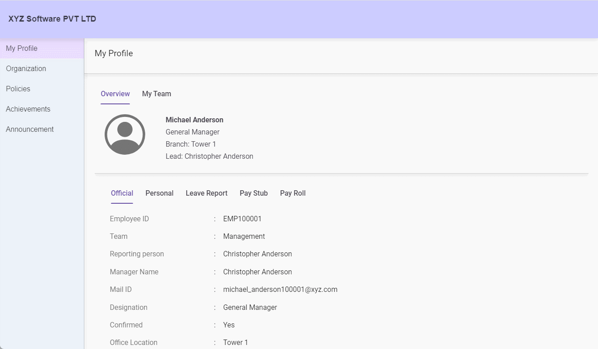
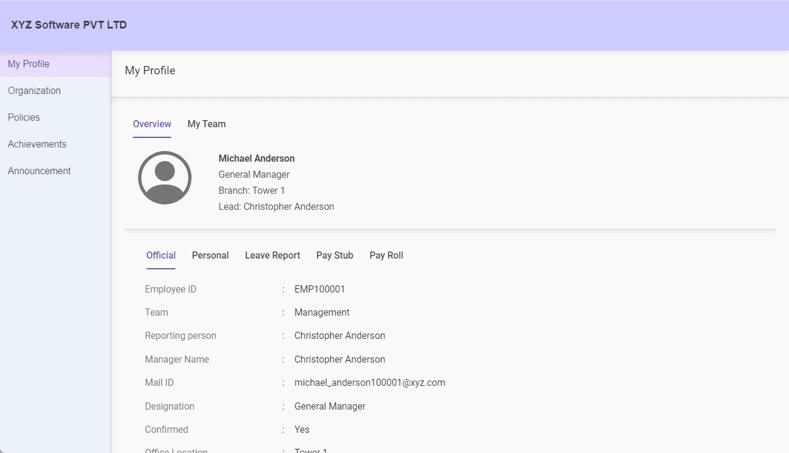

# Building an Employee Portal management application with Syncfusion React DataGrid
The Syncfusion React DataGrid is a robust and versatile data visualization component designed to efficiently manage large datasets. It offers a comprehensive range of features, including sorting, filtering, grouping, pagination, as well as data exporting and printing, all of which are essential for developing an effective and user-friendly statistics reporting tool. In this guide, we will demonstrate how to create an Employee Portal management application using the Syncfusion Data Grid.






## Target Audience
The Syncfusion React Grid component simplifies the analysis of your business data and helps manage daily data transitions. It also enables you to examine user data or product information or any values within specific time frames, whether daily or otherwise.

Additionally, it supports real-time applications with autofill capabilities and allows exporting information for hard copy documentation. Here are examples of users and organizations that benefit from using a Syncfusion React DataGrid component.
-	Healthcare
-	Retails
-	Manufacturing
-	Hospitality
-	Education
-	Technology and IT Services
-	Construction
-	Financial Services
-	Government and Public Sector
-	Logistics and Transportation
-	Nonprofit Organizations
-	Consulting and Professional Services


## Prerequisites 
-	We have developed this app by using the [node.js 16.0](https://legacy.reactjs.org/blog/2017/09/26/react-v16.0.html).
-	If you have not previously installed the React packages or if you have installed a version of node.js older than Node 16 on your machine, you can run the following command to install them.
 ```sh
  npm install -g create-react-app

  ```
## Run the sample
To execute the following command in your command prompt.
 ```sh
npm start
  ```
## Common errors

| Error  | Try to solution |
|----------|----------|
| Module not found: Can't resolve 'module'    | This indicates that the required module is either not installed properly or is missing. Therefore, we recommend ensuring that all dependency modules are installed correctly by executing either the npm install or yarn install command after deleting the package.lock.json file.   |
| npm ERR! ENOENT: no such file or directory   | This error suggests that the specified directory or file is not available on your machine, or permission for execution was denied. To resolve this, ensure that the file exists and that proper permissions are enabled for accessing the file or directory.   |
|npm ERR! Failed at the project-name@0.1.0 start script| This error occurred due to a problem with  the start script defined in your package.json file. It's important to validate the start script and execute it correctly set up to run your application. Additionally, ensure that all dependencies are installed properly or not. |
|npm ERR! EADDRINUSE: Address already in use | This error indicates the port number already used. So, you can choose another port or stop the existing running application. |
|npm ERR! Invalid package.json| This error indicates any syntax issue occurred in your package.json. to ensure all the syntax properly. |

## Reference of Syncfusion Grid
[Demo](https://ej2.syncfusion.com/react/demos/#/material3/grid/overview), <br/>
[Documentation](https://ej2.syncfusion.com/react/documentation/grid/getting-started).


